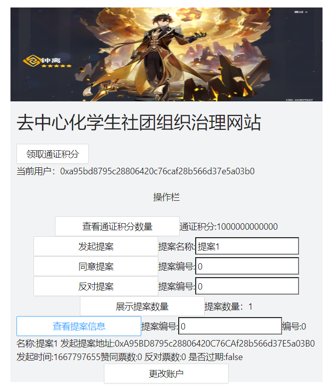

# README

# ****去中心化学生社团组织治理网站****

## 如何运行

1. 在本地启动ganache应用。
2. 在 `./contracts` 中安装需要的依赖，运行如下的命令： `bash npm install`
3. 在 `./contracts` 中编译合约，运行如下的命令： `bash npx hardhat compile`
4. 在`./contracts`中部署合约，运行如下命令：`bash npx hardhat run ./scripts/deploy.ts --network ganache` 
5. 将终端中输出的三个地址拷贝到`frontend\src\utils\contract-addresses.json`目录下的对应位置
6. 将`contracts\artifacts\contracts`下三个合约对应的json文件拷贝到`frontend\src\utils\abis`目录下
7. 在 `./frontend` 中启动前端程序，运行如下的命令： `bash npm run start`

## 功能实现分析

### 功能：

- 用户登陆网站时，与metamask钱包连接的功能
- 断开钱包连接后，更改账户的功能
- 一键领取ZJUToken的功能（每个用户只能领取一次）
- 查看拥有的Token数量的功能
- 输入提案名后，发起提案的功能
- 给定提案序号，对对应提案进行投票，包括赞成票以及反对票
- 给定提案序号，查询对应提案的信息，包括提案编号、提案名称、发起提案者地址、发起时间、赞同票数、反对票数、是否过期（即是否超过可以投票的时间）、以及是否通过（即在投票截止后赞成票数是否大于反对票数）

## 项目运行截图

点击按钮查看提案信息：

点击按钮发起提案：

.png)

点击按钮同意提案（不同意同理）：

.png)

## 参考内容

课程的参考Demo见：[DEMOs](https://github.com/LBruyne/blockchain-course-demos)。